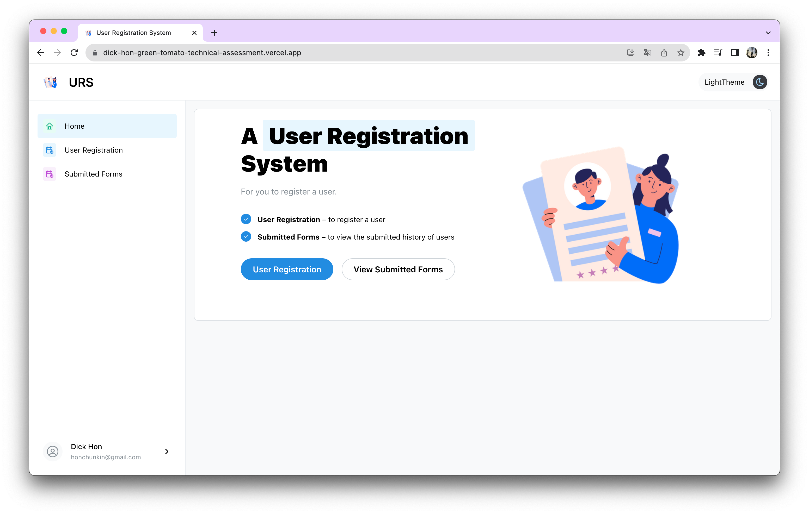
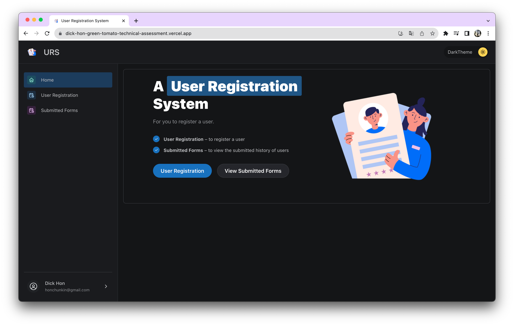

# dick-hon-green-tomato-technical-assessment

A technical assessment for create a full-stack user form application using React and NestJs.

<div align="center">
  <a href="https://dick-hon-green-tomato-technical-assessment.vercel.app/">
    
  </a>

<h3 align="center">A User Registration System</h3>

  <p align="center">
    For you to register a user.
    <br />
    <a href="https://github.com/dick-hon/dick-hon-green-tomato-technical-assessment"><strong>Explore the repository »</strong></a>
    <br />
    <br />
    <a href="https://dick-hon-green-tomato-technical-assessment.vercel.app/">View Demo</a>
  </p>
</div>

<!-- TABLE OF CONTENTS -->
<details>
  <summary>Table of Contents</summary>
  <ol>
    <li>
      <a href="#about-the-project">About The Project</a>
      <ul>
        <li><a href="#built-with">Built With</a></li>
      </ul>
    </li>
    <li>
      <a href="#getting-started">Getting Started</a>
      <ul>
        <li><a href="#prerequisites">Prerequisites</a></li>
        <li><a href="#installation">Installation</a></li>
      </ul>
    </li>
    <li><a href="#choice-of-package-choice">Choice of Package</a></li>
    <li><a href="#screenshot">Screenshot</a></li>
    <li><a href="#contact">Contact</a></li>

  </ol>
</details>

<!-- ABOUT THE PROJECT -->

## About The Project

[![Product Name Screen Shot][product-screenshot]](https://dick-hon-green-tomato-technical-assessment.vercel.app/)

This project aims to build a full-stack application for user to register a user.

<p align="right">(<a href="#top">back to top</a>)</p>

### Built With

- Frontend
  - [React](https://reactjs.org/)
  - [Mantine](https://mantine.dev/)
  - [Vercel](https://www.vercel.com/)
- Backend
  - [NestJs](https://nestjs.com)

<p align="right">(<a href="#top">back to top</a>)</p>

<!-- GETTING STARTED -->

## Getting Started

This is an example of how you may give instructions on setting up your project locally.
To get a local copy up and running follow these simple example steps.

### Prerequisites

This is an example of how to list things you need to use the software and how to install them.

- node version

  ```sh
  version >= 16.0.0
  ```

- yarn
  ```sh
  npm install yarn
  ```

### Installation

1. Get a API Key from necktie
2. Clone the repo
   ```sh
   git clone https://github.com/dick-hon/dick-hon-green-tomato-technical-assessment.git
   ```
3. Install NPM packages under `/backend` and `/frontend` respoectively
   ```sh
   yarn
   ```
4. Enter your credentials in `.env` under `/backend` and `/frontend` respectively.

   - Backend

     ```.env
     MONGO_CONNECT={MONGO_CONNECT_URL}
     ```

   - Frontend
     ```.env
     REACT_APP_API_URL={API_ENDPOINT_URL}
     ```

5. Start the frontend and backend server respectively
   - Frontend
     ```sh
     yarn start
     ```
   - Backend
     ```sh
     yarn start
     ```
6. Visit http://localhost:3000 for frontend development
7. Visit http://localhost:4000 for backend developement

<p align="right">(<a href="#top">back to top</a>)</p>

### Choice of Package

In this project, there are mainly involved xxx key packages.

#### In terms of Frontend

1. Mantine

   - Purpose
     - to act as React UI library
     - reduce the development time for customizable component (e.g. Drawer/ Menu)
   - Benefits
     - support detailed documentation
     - free and open source
     - typescript based --> can add type inference to my project
   - Drawbacks
     - Need spend time to read though the documentation
   - Assumptions
     - N/A

2. Axios

   - Purpose
     - to make HTTP request for API call
   - Benefits
     - support Promise API
     - easy to use
   - Drawbacks
     - N/A
   - Assumptions
     - the API is work haha

3. Dayjs

   - Purpose
     - to parse and display dates and times
   - Benefits
     - Fast 2kB alternative to Moment.js with the same modern API
   - Drawbacks
     - N/A
   - Assumptions
     - N/A

4. Prettier + Eslint

   - Purpose
     - For Prettier, to ensures that all outputted code conforms to a consistent style
     - For Eslint, to statically analyzes the code to quickly find problems
   - Benefits
     - make style consistent
     - avoid errors
     - improve code quality.
   - Drawbacks
     - need to config
   - Assumptions
     - to install as dev-dependency

#### In terms of Backend

1. NestJs

   - Purpose
     - (for me, is to learn a new framework)
     - as a server-side applications framework
   - Benefits
     - easy to manage and understand the codebase with scalable framework
     - support typescript
     - support built-in decorator
   - Drawbacks
     - need to read thought the documentation and learn
   - Assumptions
     - N/A

## Screenshot

   
   
   
   
   
   
   
<!-- CONTACT -->

## Contact

Hon Chun Kin, Dick - honchunkin@gmail.com

Project Link: [https://github.com/dick-hon/dick-hon-green-tomato-technical-assessment](https://github.com/dick-hon/dick-hon-green-tomato-technical-assessment)
<br/>
Project Demo: https://dick-hon-green-tomato-technical-assessment.vercel.app/

<p align="right">(<a href="#top">back to top</a>)</p>

[product-screenshot]: frontend/public/demo/home_page.png
